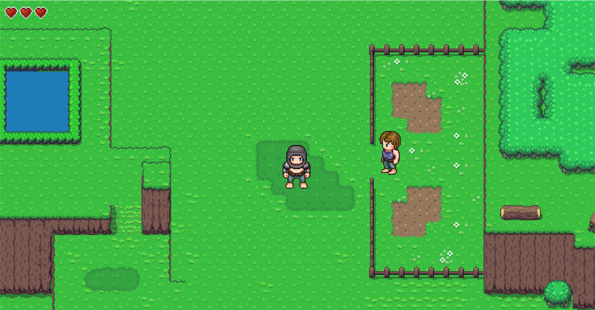
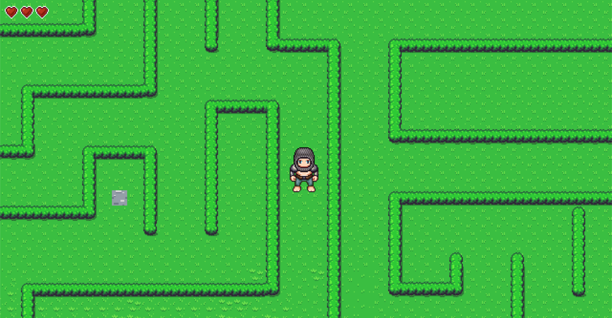

# Exeler
Open world RPG game created using the LOVE-2D framework and lua.
Showcases my game development skills at this point

## Screenshots

## How to Play
- Move around with the arrow keys or `W` `A` `S` `D`
- Use `enter` to interact with signs and NPCs
- Press `space` to use sword and `b` to use the bow

## Credits
All graphics are from OpenGameArt
- [_ArMM1998_](https://opengameart.org/users/armm1998) created the tileset
- [_Wulax_](https://opengameart.org/users/wulax) created the character sprites
- [_ansimuz_](https://opengameart.org/users/ansimuz) created the title screen background
